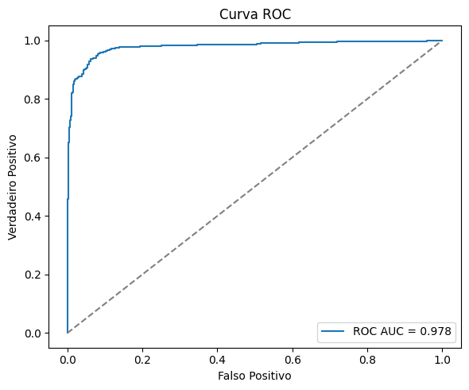
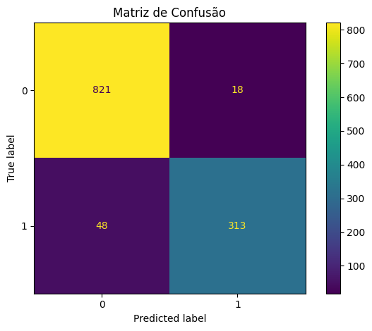
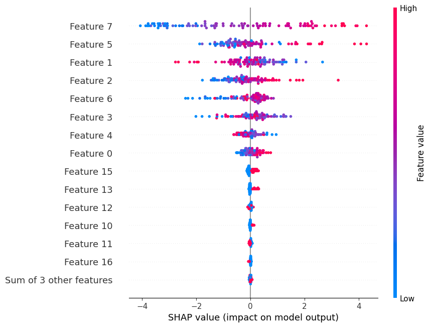

## EN
## Project: Customer Churn Prediction with XGBoost

This project demonstrates, step by step, how to train an XGBoost model to predict customer churn using a reproducible Data Science pipeline.

### Structure

```
predict_churn_XGBoost/
  ├─ src/
  │  ├─ data/
  │  ├─ features/
  │  ├─ models/
  │  ├─ utils/
  │  └─ visualization/
  ├─ notebooks/
  ├─ data/
  │  ├─ raw/
  │  └─ processed/
  ├─ models/
  ├─ reports/
  │  └─ figures/
  ├─ config/
  │  └─ config.yaml
  ├─ .devcontainer/
  │  └─ devcontainer.json
  ├─ requirements.txt
  └─ README.md
```

### How to use

1. Open this directory in VS Code and use “Reopen in Container” (Dev Containers). The container will install dependencies with `uv` using `pyproject.toml`.
2. Open the notebook at `notebooks/01_xgboost_churn.ipynb`.
3. Run the cells in order. If there is no data in `data/raw/`, a synthetic dataset will be generated and saved to `data/processed/`.

### Data

- Place your raw data file (e.g., `churn.csv`) in `data/raw/` with a target column named `churn` (0/1). The notebook attempts to automatically detect numeric and categorical columns.

### Reproducibility

- Parameters and paths can be configured in `config/config.yaml`.
- Dependency management with `uv` via `pyproject.toml`.

### Using uv locally (outside the container)

```
curl -LsSf https://astral.sh/uv/install.sh | sh
uv venv .venv
source .venv/bin/activate
uv sync
```

### Step-by-step

1. Install dependencies with `uv sync` (inside the devcontainer or local venv).
2. Open and run `notebooks/01_xgboost_churn.ipynb` top-to-bottom.
3. Outputs (figures and metrics) are generated during the run. Exported copies live under `reports/`.

### Current outputs

- Metrics (synthetic dataset example):
  - Accuracy: 0.945
  - Precision: 0.9456
  - Recall: 0.8670
  - F1: 0.9046
  - ROC AUC: 0.9785

Images exported from the latest run:








Full report (Markdown): `reports/churn_output.md`

### License

Free for educational and portfolio use.


## PT-BR
## Projeto: Predição de Churn com XGBoost

Este projeto demonstra, passo a passo, como treinar um modelo de XGBoost para prever churn de clientes usando um pipeline de Ciência de Dados reproduzível.

### Estrutura

```
predict_churn_XGBoost/
  ├─ src/
  │  ├─ data/
  │  ├─ features/
  │  ├─ models/
  │  ├─ utils/
  │  └─ visualization/
  ├─ notebooks/
  ├─ data/
  │  ├─ raw/
  │  └─ processed/
  ├─ models/
  ├─ reports/
  │  └─ figures/
  ├─ config/
  │  └─ config.yaml
  ├─ .devcontainer/
  │  └─ devcontainer.json
  ├─ requirements.txt
  └─ README.md
```

### Como usar

1. Abra este diretório no VS Code e use "Reopen in Container" (Dev Containers). O container instalará dependências com `uv` usando `pyproject.toml`.
2. Abra o notebook em `notebooks/01_xgboost_churn.ipynb`.
3. Execute as células em ordem. Se não houver dados em `data/raw/`, um dataset sintético será gerado e salvo em `data/processed/`.

### Dados

- Coloque seu arquivo de dados bruto (por exemplo, `churn.csv`) em `data/raw/` com uma coluna alvo chamada `churn` (0/1). O notebook tenta detectar automaticamente colunas numéricas e categóricas.

### Reprodutibilidade

- Parâmetros e caminhos podem ser configurados em `config/config.yaml`.
- Gerenciamento de dependências com `uv` via `pyproject.toml`.

### Usando uv localmente (fora do container)

```
curl -LsSf https://astral.sh/uv/install.sh | sh
uv venv .venv
source .venv/bin/activate
uv sync
```

### Passo a passo

1. Instale as dependências com `uv sync` (no devcontainer ou venv local).
2. Abra e execute `notebooks/01_xgboost_churn.ipynb` de cima para baixo.
3. Saídas (figuras e métricas) são geradas durante a execução. Cópias exportadas ficam em `reports/`.

### Resultados atuais

- Métricas (exemplo com dataset sintético):
  - Acurácia: 0,945
  - Precisão: 0,9456
  - Recall: 0,8670
  - F1: 0,9046
  - ROC AUC: 0,9785

Imagens exportadas da última execução:


Relatório completo (Markdown): `reports/churn_output.md`

### Licença

Livre para uso educacional e de portfólio.


