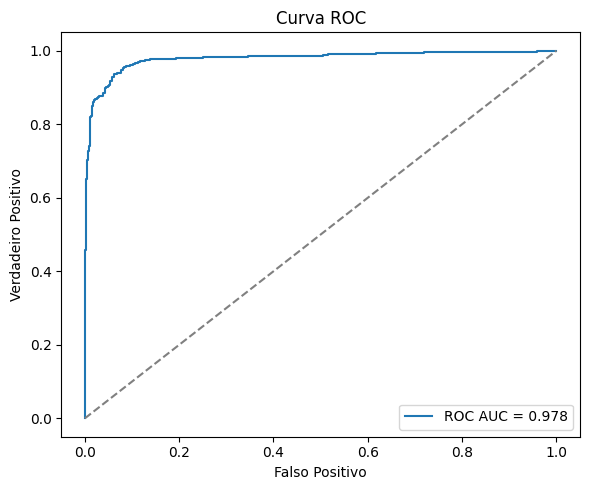
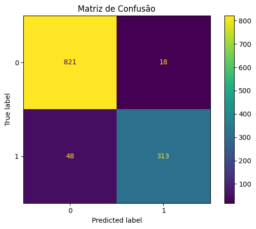
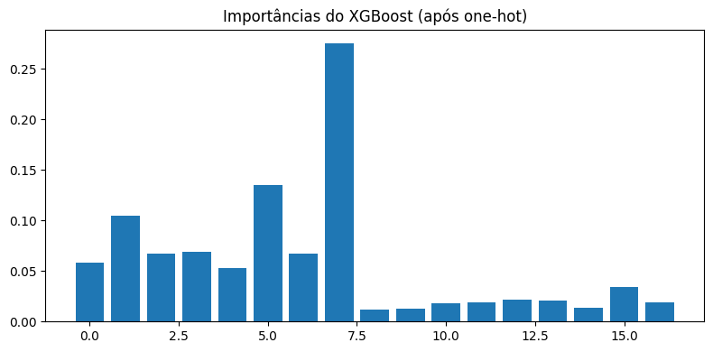
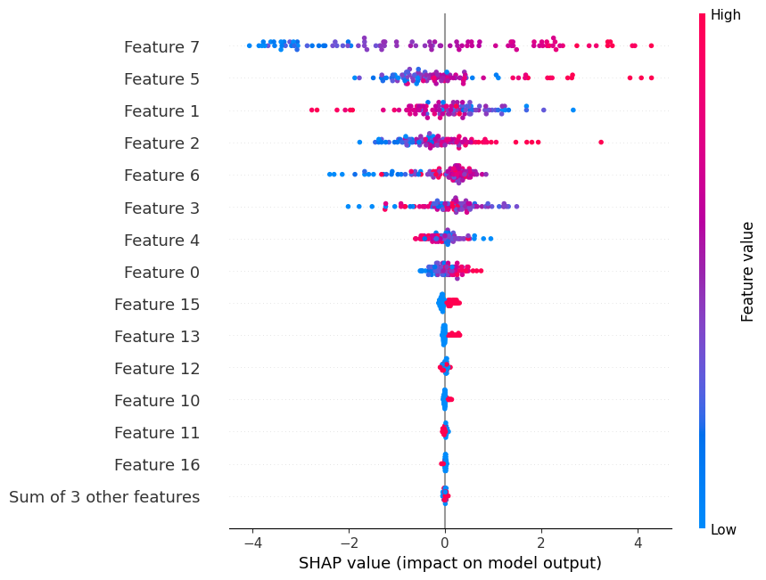

# Predição de Churn com XGBoost

Este notebook guia você passo a passo:

1. Configuração e dependências
2. Carregamento de dados (CSV ou geração sintética)
3. Exploração rápida
4. Pré-processamento (numérico/categórico)
5. Treino do XGBoost
6. Avaliação (métricas, ROC, matriz de confusão)
7. Explicabilidade (importâncias e SHAP)

Obs.: Ajuste `config/config.yaml` para caminhos e hiperparâmetros.


```python
# Configuração
import os, sys
from pathlib import Path
import yaml

PROJECT_ROOT = Path("..").resolve()
sys.path.insert(0, str(PROJECT_ROOT))
CONFIG_PATH = PROJECT_ROOT / "config" / "config.yaml"

with open(CONFIG_PATH, "r", encoding="utf-8") as f:
    CFG = yaml.safe_load(f)

CFG

```


    {'seed': 42,
     'paths': {'raw_data': 'data/raw/churn.csv',
      'processed_data': 'data/processed/churn_processed.csv',
      'model_dir': 'models',
      'model_file': 'models/xgb_churn.pkl'},
     'model': {'xgboost': {'n_estimators': 300,
       'learning_rate': 0.05,
       'max_depth': 5,
       'subsample': 0.9,
       'colsample_bytree': 0.9,
       'reg_lambda': 1.0,
       'reg_alpha': 0.0,
       'random_state': 42,
       'tree_method': 'auto'}},
     'target': 'churn',
     'test_size': 0.2,
     'positive_class': 1}


```python
# Imports principais
import numpy as np
import pandas as pd
import seaborn as sns
import matplotlib.pyplot as plt

from src.data.load import load_raw_csv, generate_synthetic_churn
from src.features.preprocess import build_preprocessing_pipeline
from src.models.train import train_xgboost_classifier
from src.models.evaluate import evaluate_classification, plot_roc_curve, plot_confusion


```


```python
# Carregamento dos dados (CSV se existir; senão, sintético)
from pathlib import Path
raw_path = PROJECT_ROOT / CFG["paths"]["raw_data"]

if raw_path.exists():
    df = load_raw_csv(raw_path)
else:
    df = generate_synthetic_churn(n_samples=6000, random_state=CFG["seed"])

print(df.shape)
df.head()

```

    (6000, 12)


<div>
<style scoped>
    .dataframe tbody tr th:only-of-type {
        vertical-align: middle;
    }

    .dataframe tbody tr th {
        vertical-align: top;
    }

    .dataframe thead th {
        text-align: right;
    }
</style>
<table border="1" class="dataframe">
  <thead>
    <tr style="text-align: right;">
      <th></th>
      <th>num_0</th>
      <th>num_1</th>
      <th>num_2</th>
      <th>num_3</th>
      <th>num_4</th>
      <th>num_5</th>
      <th>num_6</th>
      <th>num_7</th>
      <th>cat_0</th>
      <th>cat_1</th>
      <th>cat_2</th>
      <th>churn</th>
    </tr>
  </thead>
  <tbody>
    <tr>
      <th>0</th>
      <td>2.463179</td>
      <td>-0.177731</td>
      <td>-3.097837</td>
      <td>-0.725202</td>
      <td>2.895848</td>
      <td>-0.562587</td>
      <td>-0.817984</td>
      <td>-2.460159</td>
      <td>B</td>
      <td>A</td>
      <td>B</td>
      <td>0</td>
    </tr>
    <tr>
      <th>1</th>
      <td>2.094274</td>
      <td>-2.264422</td>
      <td>-2.082028</td>
      <td>0.329499</td>
      <td>3.714637</td>
      <td>-1.260572</td>
      <td>-1.466198</td>
      <td>-3.265193</td>
      <td>A</td>
      <td>A</td>
      <td>A</td>
      <td>0</td>
    </tr>
    <tr>
      <th>2</th>
      <td>-7.361267</td>
      <td>2.463211</td>
      <td>3.709226</td>
      <td>-1.086643</td>
      <td>-3.817241</td>
      <td>0.444539</td>
      <td>0.906436</td>
      <td>-2.893073</td>
      <td>C</td>
      <td>B</td>
      <td>A</td>
      <td>0</td>
    </tr>
    <tr>
      <th>3</th>
      <td>4.579471</td>
      <td>-2.253837</td>
      <td>-2.722456</td>
      <td>-1.556011</td>
      <td>3.003207</td>
      <td>-2.887207</td>
      <td>-1.431753</td>
      <td>-1.218797</td>
      <td>B</td>
      <td>A</td>
      <td>C</td>
      <td>0</td>
    </tr>
    <tr>
      <th>4</th>
      <td>2.604669</td>
      <td>-0.654109</td>
      <td>-1.492855</td>
      <td>-0.734632</td>
      <td>3.530144</td>
      <td>0.096220</td>
      <td>-1.680168</td>
      <td>-2.052385</td>
      <td>A</td>
      <td>A</td>
      <td>A</td>
      <td>0</td>
    </tr>
  </tbody>
</table>
</div>


```python
# Exploração rápida
df.describe(include="all").T.head(20)

```


<div>
<style scoped>
    .dataframe tbody tr th:only-of-type {
        vertical-align: middle;
    }

    .dataframe tbody tr th {
        vertical-align: top;
    }

    .dataframe thead th {
        text-align: right;
    }
</style>
<table border="1" class="dataframe">
  <thead>
    <tr style="text-align: right;">
      <th></th>
      <th>count</th>
      <th>unique</th>
      <th>top</th>
      <th>freq</th>
      <th>mean</th>
      <th>std</th>
      <th>min</th>
      <th>25%</th>
      <th>50%</th>
      <th>75%</th>
      <th>max</th>
    </tr>
  </thead>
  <tbody>
    <tr>
      <th>num_0</th>
      <td>6000.0</td>
      <td>NaN</td>
      <td>NaN</td>
      <td>NaN</td>
      <td>-0.106486</td>
      <td>3.168844</td>
      <td>-8.406103</td>
      <td>-2.554666</td>
      <td>-0.313194</td>
      <td>2.203517</td>
      <td>11.761891</td>
    </tr>
    <tr>
      <th>num_1</th>
      <td>6000.0</td>
      <td>NaN</td>
      <td>NaN</td>
      <td>NaN</td>
      <td>-0.018586</td>
      <td>1.829413</td>
      <td>-6.571931</td>
      <td>-1.284798</td>
      <td>0.015372</td>
      <td>1.245171</td>
      <td>6.13653</td>
    </tr>
    <tr>
      <th>num_2</th>
      <td>6000.0</td>
      <td>NaN</td>
      <td>NaN</td>
      <td>NaN</td>
      <td>0.320547</td>
      <td>1.757557</td>
      <td>-6.011689</td>
      <td>-0.770971</td>
      <td>0.508473</td>
      <td>1.518202</td>
      <td>6.03457</td>
    </tr>
    <tr>
      <th>num_3</th>
      <td>6000.0</td>
      <td>NaN</td>
      <td>NaN</td>
      <td>NaN</td>
      <td>0.008751</td>
      <td>1.621336</td>
      <td>-5.448052</td>
      <td>-1.120434</td>
      <td>0.089713</td>
      <td>1.162933</td>
      <td>5.56998</td>
    </tr>
    <tr>
      <th>num_4</th>
      <td>6000.0</td>
      <td>NaN</td>
      <td>NaN</td>
      <td>NaN</td>
      <td>0.208493</td>
      <td>2.517239</td>
      <td>-9.348756</td>
      <td>-1.615395</td>
      <td>0.068562</td>
      <td>1.991243</td>
      <td>10.738873</td>
    </tr>
    <tr>
      <th>num_5</th>
      <td>6000.0</td>
      <td>NaN</td>
      <td>NaN</td>
      <td>NaN</td>
      <td>-0.710607</td>
      <td>1.571916</td>
      <td>-6.199312</td>
      <td>-1.791696</td>
      <td>-0.753212</td>
      <td>0.344837</td>
      <td>5.483993</td>
    </tr>
    <tr>
      <th>num_6</th>
      <td>6000.0</td>
      <td>NaN</td>
      <td>NaN</td>
      <td>NaN</td>
      <td>-0.999788</td>
      <td>1.28379</td>
      <td>-6.426719</td>
      <td>-1.816934</td>
      <td>-0.995561</td>
      <td>-0.18742</td>
      <td>3.609235</td>
    </tr>
    <tr>
      <th>num_7</th>
      <td>6000.0</td>
      <td>NaN</td>
      <td>NaN</td>
      <td>NaN</td>
      <td>-0.439406</td>
      <td>1.679788</td>
      <td>-6.264126</td>
      <td>-1.615417</td>
      <td>-0.477372</td>
      <td>0.72428</td>
      <td>6.338928</td>
    </tr>
    <tr>
      <th>cat_0</th>
      <td>6000</td>
      <td>3</td>
      <td>A</td>
      <td>3047</td>
      <td>NaN</td>
      <td>NaN</td>
      <td>NaN</td>
      <td>NaN</td>
      <td>NaN</td>
      <td>NaN</td>
      <td>NaN</td>
    </tr>
    <tr>
      <th>cat_1</th>
      <td>6000</td>
      <td>3</td>
      <td>A</td>
      <td>2963</td>
      <td>NaN</td>
      <td>NaN</td>
      <td>NaN</td>
      <td>NaN</td>
      <td>NaN</td>
      <td>NaN</td>
      <td>NaN</td>
    </tr>
    <tr>
      <th>cat_2</th>
      <td>6000</td>
      <td>3</td>
      <td>A</td>
      <td>2955</td>
      <td>NaN</td>
      <td>NaN</td>
      <td>NaN</td>
      <td>NaN</td>
      <td>NaN</td>
      <td>NaN</td>
      <td>NaN</td>
    </tr>
    <tr>
      <th>churn</th>
      <td>6000.0</td>
      <td>NaN</td>
      <td>NaN</td>
      <td>NaN</td>
      <td>0.3005</td>
      <td>0.458514</td>
      <td>0.0</td>
      <td>0.0</td>
      <td>0.0</td>
      <td>1.0</td>
      <td>1.0</td>
    </tr>
  </tbody>
</table>
</div>


```python
# Pré-processamento
from src.features.preprocess import build_preprocessing_pipeline

target = CFG["target"]
preprocessor, num_cols, cat_cols = build_preprocessing_pipeline(df, target)

len(num_cols), len(cat_cols), num_cols[:5], cat_cols[:5]

```


    (8,
     3,
     ['num_0', 'num_1', 'num_2', 'num_3', 'num_4'],
     ['cat_0', 'cat_1', 'cat_2'])


```python
# Treino do XGBoost
from xgboost import XGBClassifier
params = CFG["model"]["xgboost"].copy()

result = train_xgboost_classifier(
    df=df,
    target=target,
    preprocessor=preprocessor,
    params=params,
    test_size=CFG["test_size"],
    random_state=CFG["seed"],
)

result.pipeline

```


<style>#sk-container-id-1 {
  /* Definition of color scheme common for light and dark mode */
  --sklearn-color-text: #000;
  --sklearn-color-text-muted: #666;
  --sklearn-color-line: gray;
  /* Definition of color scheme for unfitted estimators */
  --sklearn-color-unfitted-level-0: #fff5e6;
  --sklearn-color-unfitted-level-1: #f6e4d2;
  --sklearn-color-unfitted-level-2: #ffe0b3;
  --sklearn-color-unfitted-level-3: chocolate;
  /* Definition of color scheme for fitted estimators */
  --sklearn-color-fitted-level-0: #f0f8ff;
  --sklearn-color-fitted-level-1: #d4ebff;
  --sklearn-color-fitted-level-2: #b3dbfd;
  --sklearn-color-fitted-level-3: cornflowerblue;

  /* Specific color for light theme */
  --sklearn-color-text-on-default-background: var(--sg-text-color, var(--theme-code-foreground, var(--jp-content-font-color1, black)));
  --sklearn-color-background: var(--sg-background-color, var(--theme-background, var(--jp-layout-color0, white)));
  --sklearn-color-border-box: var(--sg-text-color, var(--theme-code-foreground, var(--jp-content-font-color1, black)));
  --sklearn-color-icon: #696969;

  @media (prefers-color-scheme: dark) {
    /* Redefinition of color scheme for dark theme */
    --sklearn-color-text-on-default-background: var(--sg-text-color, var(--theme-code-foreground, var(--jp-content-font-color1, white)));
    --sklearn-color-background: var(--sg-background-color, var(--theme-background, var(--jp-layout-color0, #111)));
    --sklearn-color-border-box: var(--sg-text-color, var(--theme-code-foreground, var(--jp-content-font-color1, white)));
    --sklearn-color-icon: #878787;
  }
}

#sk-container-id-1 {
  color: var(--sklearn-color-text);
}

#sk-container-id-1 pre {
  padding: 0;
}

#sk-container-id-1 input.sk-hidden--visually {
  border: 0;
  clip: rect(1px 1px 1px 1px);
  clip: rect(1px, 1px, 1px, 1px);
  height: 1px;
  margin: -1px;
  overflow: hidden;
  padding: 0;
  position: absolute;
  width: 1px;
}

#sk-container-id-1 div.sk-dashed-wrapped {
  border: 1px dashed var(--sklearn-color-line);
  margin: 0 0.4em 0.5em 0.4em;
  box-sizing: border-box;
  padding-bottom: 0.4em;
  background-color: var(--sklearn-color-background);
}

#sk-container-id-1 div.sk-container {
  /* jupyter's `normalize.less` sets `[hidden] { display: none; }`
     but bootstrap.min.css set `[hidden] { display: none !important; }`
     so we also need the `!important` here to be able to override the
     default hidden behavior on the sphinx rendered scikit-learn.org.
     See: https://github.com/scikit-learn/scikit-learn/issues/21755 */
  display: inline-block !important;
  position: relative;
}

#sk-container-id-1 div.sk-text-repr-fallback {
  display: none;
}

div.sk-parallel-item,
div.sk-serial,
div.sk-item {
  /* draw centered vertical line to link estimators */
  background-image: linear-gradient(var(--sklearn-color-text-on-default-background), var(--sklearn-color-text-on-default-background));
  background-size: 2px 100%;
  background-repeat: no-repeat;
  background-position: center center;
}

/* Parallel-specific style estimator block */

#sk-container-id-1 div.sk-parallel-item::after {
  content: "";
  width: 100%;
  border-bottom: 2px solid var(--sklearn-color-text-on-default-background);
  flex-grow: 1;
}

#sk-container-id-1 div.sk-parallel {
  display: flex;
  align-items: stretch;
  justify-content: center;
  background-color: var(--sklearn-color-background);
  position: relative;
}

#sk-container-id-1 div.sk-parallel-item {
  display: flex;
  flex-direction: column;
}

#sk-container-id-1 div.sk-parallel-item:first-child::after {
  align-self: flex-end;
  width: 50%;
}

#sk-container-id-1 div.sk-parallel-item:last-child::after {
  align-self: flex-start;
  width: 50%;
}

#sk-container-id-1 div.sk-parallel-item:only-child::after {
  width: 0;
}

/* Serial-specific style estimator block */

#sk-container-id-1 div.sk-serial {
  display: flex;
  flex-direction: column;
  align-items: center;
  background-color: var(--sklearn-color-background);
  padding-right: 1em;
  padding-left: 1em;
}


/* Toggleable style: style used for estimator/Pipeline/ColumnTransformer box that is
clickable and can be expanded/collapsed.
- Pipeline and ColumnTransformer use this feature and define the default style
- Estimators will overwrite some part of the style using the `sk-estimator` class
*/

/* Pipeline and ColumnTransformer style (default) */

#sk-container-id-1 div.sk-toggleable {
  /* Default theme specific background. It is overwritten whether we have a
  specific estimator or a Pipeline/ColumnTransformer */
  background-color: var(--sklearn-color-background);
}

/* Toggleable label */
#sk-container-id-1 label.sk-toggleable__label {
  cursor: pointer;
  display: flex;
  width: 100%;
  margin-bottom: 0;
  padding: 0.5em;
  box-sizing: border-box;
  text-align: center;
  align-items: start;
  justify-content: space-between;
  gap: 0.5em;
}

#sk-container-id-1 label.sk-toggleable__label .caption {
  font-size: 0.6rem;
  font-weight: lighter;
  color: var(--sklearn-color-text-muted);
}

#sk-container-id-1 label.sk-toggleable__label-arrow:before {
  /* Arrow on the left of the label */
  content: "▸";
  float: left;
  margin-right: 0.25em;
  color: var(--sklearn-color-icon);
}

#sk-container-id-1 label.sk-toggleable__label-arrow:hover:before {
  color: var(--sklearn-color-text);
}

/* Toggleable content - dropdown */

#sk-container-id-1 div.sk-toggleable__content {
  max-height: 0;
  max-width: 0;
  overflow: hidden;
  text-align: left;
  /* unfitted */
  background-color: var(--sklearn-color-unfitted-level-0);
}

#sk-container-id-1 div.sk-toggleable__content.fitted {
  /* fitted */
  background-color: var(--sklearn-color-fitted-level-0);
}

#sk-container-id-1 div.sk-toggleable__content pre {
  margin: 0.2em;
  border-radius: 0.25em;
  color: var(--sklearn-color-text);
  /* unfitted */
  background-color: var(--sklearn-color-unfitted-level-0);
}

#sk-container-id-1 div.sk-toggleable__content.fitted pre {
  /* unfitted */
  background-color: var(--sklearn-color-fitted-level-0);
}

#sk-container-id-1 input.sk-toggleable__control:checked~div.sk-toggleable__content {
  /* Expand drop-down */
  max-height: 200px;
  max-width: 100%;
  overflow: auto;
}

#sk-container-id-1 input.sk-toggleable__control:checked~label.sk-toggleable__label-arrow:before {
  content: "▾";
}

/* Pipeline/ColumnTransformer-specific style */

#sk-container-id-1 div.sk-label input.sk-toggleable__control:checked~label.sk-toggleable__label {
  color: var(--sklearn-color-text);
  background-color: var(--sklearn-color-unfitted-level-2);
}

#sk-container-id-1 div.sk-label.fitted input.sk-toggleable__control:checked~label.sk-toggleable__label {
  background-color: var(--sklearn-color-fitted-level-2);
}

/* Estimator-specific style */

/* Colorize estimator box */
#sk-container-id-1 div.sk-estimator input.sk-toggleable__control:checked~label.sk-toggleable__label {
  /* unfitted */
  background-color: var(--sklearn-color-unfitted-level-2);
}

#sk-container-id-1 div.sk-estimator.fitted input.sk-toggleable__control:checked~label.sk-toggleable__label {
  /* fitted */
  background-color: var(--sklearn-color-fitted-level-2);
}

#sk-container-id-1 div.sk-label label.sk-toggleable__label,
#sk-container-id-1 div.sk-label label {
  /* The background is the default theme color */
  color: var(--sklearn-color-text-on-default-background);
}

/* On hover, darken the color of the background */
#sk-container-id-1 div.sk-label:hover label.sk-toggleable__label {
  color: var(--sklearn-color-text);
  background-color: var(--sklearn-color-unfitted-level-2);
}

/* Label box, darken color on hover, fitted */
#sk-container-id-1 div.sk-label.fitted:hover label.sk-toggleable__label.fitted {
  color: var(--sklearn-color-text);
  background-color: var(--sklearn-color-fitted-level-2);
}

/* Estimator label */

#sk-container-id-1 div.sk-label label {
  font-family: monospace;
  font-weight: bold;
  display: inline-block;
  line-height: 1.2em;
}

#sk-container-id-1 div.sk-label-container {
  text-align: center;
}

/* Estimator-specific */
#sk-container-id-1 div.sk-estimator {
  font-family: monospace;
  border: 1px dotted var(--sklearn-color-border-box);
  border-radius: 0.25em;
  box-sizing: border-box;
  margin-bottom: 0.5em;
  /* unfitted */
  background-color: var(--sklearn-color-unfitted-level-0);
}

#sk-container-id-1 div.sk-estimator.fitted {
  /* fitted */
  background-color: var(--sklearn-color-fitted-level-0);
}

/* on hover */
#sk-container-id-1 div.sk-estimator:hover {
  /* unfitted */
  background-color: var(--sklearn-color-unfitted-level-2);
}

#sk-container-id-1 div.sk-estimator.fitted:hover {
  /* fitted */
  background-color: var(--sklearn-color-fitted-level-2);
}

/* Specification for estimator info (e.g. "i" and "?") */

/* Common style for "i" and "?" */

.sk-estimator-doc-link,
a:link.sk-estimator-doc-link,
a:visited.sk-estimator-doc-link {
  float: right;
  font-size: smaller;
  line-height: 1em;
  font-family: monospace;
  background-color: var(--sklearn-color-background);
  border-radius: 1em;
  height: 1em;
  width: 1em;
  text-decoration: none !important;
  margin-left: 0.5em;
  text-align: center;
  /* unfitted */
  border: var(--sklearn-color-unfitted-level-1) 1pt solid;
  color: var(--sklearn-color-unfitted-level-1);
}

.sk-estimator-doc-link.fitted,
a:link.sk-estimator-doc-link.fitted,
a:visited.sk-estimator-doc-link.fitted {
  /* fitted */
  border: var(--sklearn-color-fitted-level-1) 1pt solid;
  color: var(--sklearn-color-fitted-level-1);
}

/* On hover */
div.sk-estimator:hover .sk-estimator-doc-link:hover,
.sk-estimator-doc-link:hover,
div.sk-label-container:hover .sk-estimator-doc-link:hover,
.sk-estimator-doc-link:hover {
  /* unfitted */
  background-color: var(--sklearn-color-unfitted-level-3);
  color: var(--sklearn-color-background);
  text-decoration: none;
}

div.sk-estimator.fitted:hover .sk-estimator-doc-link.fitted:hover,
.sk-estimator-doc-link.fitted:hover,
div.sk-label-container:hover .sk-estimator-doc-link.fitted:hover,
.sk-estimator-doc-link.fitted:hover {
  /* fitted */
  background-color: var(--sklearn-color-fitted-level-3);
  color: var(--sklearn-color-background);
  text-decoration: none;
}

/* Span, style for the box shown on hovering the info icon */
.sk-estimator-doc-link span {
  display: none;
  z-index: 9999;
  position: relative;
  font-weight: normal;
  right: .2ex;
  padding: .5ex;
  margin: .5ex;
  width: min-content;
  min-width: 20ex;
  max-width: 50ex;
  color: var(--sklearn-color-text);
  box-shadow: 2pt 2pt 4pt #999;
  /* unfitted */
  background: var(--sklearn-color-unfitted-level-0);
  border: .5pt solid var(--sklearn-color-unfitted-level-3);
}

.sk-estimator-doc-link.fitted span {
  /* fitted */
  background: var(--sklearn-color-fitted-level-0);
  border: var(--sklearn-color-fitted-level-3);
}

.sk-estimator-doc-link:hover span {
  display: block;
}

/* "?"-specific style due to the `<a>` HTML tag */

#sk-container-id-1 a.estimator_doc_link {
  float: right;
  font-size: 1rem;
  line-height: 1em;
  font-family: monospace;
  background-color: var(--sklearn-color-background);
  border-radius: 1rem;
  height: 1rem;
  width: 1rem;
  text-decoration: none;
  /* unfitted */
  color: var(--sklearn-color-unfitted-level-1);
  border: var(--sklearn-color-unfitted-level-1) 1pt solid;
}

#sk-container-id-1 a.estimator_doc_link.fitted {
  /* fitted */
  border: var(--sklearn-color-fitted-level-1) 1pt solid;
  color: var(--sklearn-color-fitted-level-1);
}

/* On hover */
#sk-container-id-1 a.estimator_doc_link:hover {
  /* unfitted */
  background-color: var(--sklearn-color-unfitted-level-3);
  color: var(--sklearn-color-background);
  text-decoration: none;
}

#sk-container-id-1 a.estimator_doc_link.fitted:hover {
  /* fitted */
  background-color: var(--sklearn-color-fitted-level-3);
}
</style><div id="sk-container-id-1" class="sk-top-container"><div class="sk-text-repr-fallback"><pre>Pipeline(steps=[(&#x27;preprocessor&#x27;,
                 ColumnTransformer(transformers=[(&#x27;num&#x27;,
                                                  Pipeline(steps=[(&#x27;imputer&#x27;,
                                                                   SimpleImputer(strategy=&#x27;median&#x27;)),
                                                                  (&#x27;scaler&#x27;,
                                                                   StandardScaler())]),
                                                  [&#x27;num_0&#x27;, &#x27;num_1&#x27;, &#x27;num_2&#x27;,
                                                   &#x27;num_3&#x27;, &#x27;num_4&#x27;, &#x27;num_5&#x27;,
                                                   &#x27;num_6&#x27;, &#x27;num_7&#x27;]),
                                                 (&#x27;cat&#x27;,
                                                  Pipeline(steps=[(&#x27;imputer&#x27;,
                                                                   SimpleImputer(strategy=&#x27;most_frequent&#x27;)),
                                                                  (&#x27;onehot&#x27;,
                                                                   OneHotEncoder(handle_unknown=&#x27;ignore...
                               feature_types=None, gamma=None, grow_policy=None,
                               importance_type=None,
                               interaction_constraints=None, learning_rate=0.05,
                               max_bin=None, max_cat_threshold=None,
                               max_cat_to_onehot=None, max_delta_step=None,
                               max_depth=5, max_leaves=None,
                               min_child_weight=None, missing=nan,
                               monotone_constraints=None, multi_strategy=None,
                               n_estimators=300, n_jobs=None,
                               num_parallel_tree=None, random_state=42, ...))])</pre><b>In a Jupyter environment, please rerun this cell to show the HTML representation or trust the notebook. <br />On GitHub, the HTML representation is unable to render, please try loading this page with nbviewer.org.</b></div><div class="sk-container" hidden><div class="sk-item sk-dashed-wrapped"><div class="sk-label-container"><div class="sk-label fitted sk-toggleable"><input class="sk-toggleable__control sk-hidden--visually" id="sk-estimator-id-1" type="checkbox" ><label for="sk-estimator-id-1" class="sk-toggleable__label fitted sk-toggleable__label-arrow"><div><div>Pipeline</div></div><div><a class="sk-estimator-doc-link fitted" rel="noreferrer" target="_blank" href="https://scikit-learn.org/1.6/modules/generated/sklearn.pipeline.Pipeline.html">?<span>Documentation for Pipeline</span></a><span class="sk-estimator-doc-link fitted">i<span>Fitted</span></span></div></label><div class="sk-toggleable__content fitted"><pre>Pipeline(steps=[(&#x27;preprocessor&#x27;,
                 ColumnTransformer(transformers=[(&#x27;num&#x27;,
                                                  Pipeline(steps=[(&#x27;imputer&#x27;,
                                                                   SimpleImputer(strategy=&#x27;median&#x27;)),
                                                                  (&#x27;scaler&#x27;,
                                                                   StandardScaler())]),
                                                  [&#x27;num_0&#x27;, &#x27;num_1&#x27;, &#x27;num_2&#x27;,
                                                   &#x27;num_3&#x27;, &#x27;num_4&#x27;, &#x27;num_5&#x27;,
                                                   &#x27;num_6&#x27;, &#x27;num_7&#x27;]),
                                                 (&#x27;cat&#x27;,
                                                  Pipeline(steps=[(&#x27;imputer&#x27;,
                                                                   SimpleImputer(strategy=&#x27;most_frequent&#x27;)),
                                                                  (&#x27;onehot&#x27;,
                                                                   OneHotEncoder(handle_unknown=&#x27;ignore...
                               feature_types=None, gamma=None, grow_policy=None,
                               importance_type=None,
                               interaction_constraints=None, learning_rate=0.05,
                               max_bin=None, max_cat_threshold=None,
                               max_cat_to_onehot=None, max_delta_step=None,
                               max_depth=5, max_leaves=None,
                               min_child_weight=None, missing=nan,
                               monotone_constraints=None, multi_strategy=None,
                               n_estimators=300, n_jobs=None,
                               num_parallel_tree=None, random_state=42, ...))])</pre></div> </div></div><div class="sk-serial"><div class="sk-item sk-dashed-wrapped"><div class="sk-label-container"><div class="sk-label fitted sk-toggleable"><input class="sk-toggleable__control sk-hidden--visually" id="sk-estimator-id-2" type="checkbox" ><label for="sk-estimator-id-2" class="sk-toggleable__label fitted sk-toggleable__label-arrow"><div><div>preprocessor: ColumnTransformer</div></div><div><a class="sk-estimator-doc-link fitted" rel="noreferrer" target="_blank" href="https://scikit-learn.org/1.6/modules/generated/sklearn.compose.ColumnTransformer.html">?<span>Documentation for preprocessor: ColumnTransformer</span></a></div></label><div class="sk-toggleable__content fitted"><pre>ColumnTransformer(transformers=[(&#x27;num&#x27;,
                                 Pipeline(steps=[(&#x27;imputer&#x27;,
                                                  SimpleImputer(strategy=&#x27;median&#x27;)),
                                                 (&#x27;scaler&#x27;, StandardScaler())]),
                                 [&#x27;num_0&#x27;, &#x27;num_1&#x27;, &#x27;num_2&#x27;, &#x27;num_3&#x27;, &#x27;num_4&#x27;,
                                  &#x27;num_5&#x27;, &#x27;num_6&#x27;, &#x27;num_7&#x27;]),
                                (&#x27;cat&#x27;,
                                 Pipeline(steps=[(&#x27;imputer&#x27;,
                                                  SimpleImputer(strategy=&#x27;most_frequent&#x27;)),
                                                 (&#x27;onehot&#x27;,
                                                  OneHotEncoder(handle_unknown=&#x27;ignore&#x27;,
                                                                sparse_output=False))]),
                                 [&#x27;cat_0&#x27;, &#x27;cat_1&#x27;, &#x27;cat_2&#x27;])])</pre></div> </div></div><div class="sk-parallel"><div class="sk-parallel-item"><div class="sk-item"><div class="sk-label-container"><div class="sk-label fitted sk-toggleable"><input class="sk-toggleable__control sk-hidden--visually" id="sk-estimator-id-3" type="checkbox" ><label for="sk-estimator-id-3" class="sk-toggleable__label fitted sk-toggleable__label-arrow"><div><div>num</div></div></label><div class="sk-toggleable__content fitted"><pre>[&#x27;num_0&#x27;, &#x27;num_1&#x27;, &#x27;num_2&#x27;, &#x27;num_3&#x27;, &#x27;num_4&#x27;, &#x27;num_5&#x27;, &#x27;num_6&#x27;, &#x27;num_7&#x27;]</pre></div> </div></div><div class="sk-serial"><div class="sk-item"><div class="sk-serial"><div class="sk-item"><div class="sk-estimator fitted sk-toggleable"><input class="sk-toggleable__control sk-hidden--visually" id="sk-estimator-id-4" type="checkbox" ><label for="sk-estimator-id-4" class="sk-toggleable__label fitted sk-toggleable__label-arrow"><div><div>SimpleImputer</div></div><div><a class="sk-estimator-doc-link fitted" rel="noreferrer" target="_blank" href="https://scikit-learn.org/1.6/modules/generated/sklearn.impute.SimpleImputer.html">?<span>Documentation for SimpleImputer</span></a></div></label><div class="sk-toggleable__content fitted"><pre>SimpleImputer(strategy=&#x27;median&#x27;)</pre></div> </div></div><div class="sk-item"><div class="sk-estimator fitted sk-toggleable"><input class="sk-toggleable__control sk-hidden--visually" id="sk-estimator-id-5" type="checkbox" ><label for="sk-estimator-id-5" class="sk-toggleable__label fitted sk-toggleable__label-arrow"><div><div>StandardScaler</div></div><div><a class="sk-estimator-doc-link fitted" rel="noreferrer" target="_blank" href="https://scikit-learn.org/1.6/modules/generated/sklearn.preprocessing.StandardScaler.html">?<span>Documentation for StandardScaler</span></a></div></label><div class="sk-toggleable__content fitted"><pre>StandardScaler()</pre></div> </div></div></div></div></div></div></div><div class="sk-parallel-item"><div class="sk-item"><div class="sk-label-container"><div class="sk-label fitted sk-toggleable"><input class="sk-toggleable__control sk-hidden--visually" id="sk-estimator-id-6" type="checkbox" ><label for="sk-estimator-id-6" class="sk-toggleable__label fitted sk-toggleable__label-arrow"><div><div>cat</div></div></label><div class="sk-toggleable__content fitted"><pre>[&#x27;cat_0&#x27;, &#x27;cat_1&#x27;, &#x27;cat_2&#x27;]</pre></div> </div></div><div class="sk-serial"><div class="sk-item"><div class="sk-serial"><div class="sk-item"><div class="sk-estimator fitted sk-toggleable"><input class="sk-toggleable__control sk-hidden--visually" id="sk-estimator-id-7" type="checkbox" ><label for="sk-estimator-id-7" class="sk-toggleable__label fitted sk-toggleable__label-arrow"><div><div>SimpleImputer</div></div><div><a class="sk-estimator-doc-link fitted" rel="noreferrer" target="_blank" href="https://scikit-learn.org/1.6/modules/generated/sklearn.impute.SimpleImputer.html">?<span>Documentation for SimpleImputer</span></a></div></label><div class="sk-toggleable__content fitted"><pre>SimpleImputer(strategy=&#x27;most_frequent&#x27;)</pre></div> </div></div><div class="sk-item"><div class="sk-estimator fitted sk-toggleable"><input class="sk-toggleable__control sk-hidden--visually" id="sk-estimator-id-8" type="checkbox" ><label for="sk-estimator-id-8" class="sk-toggleable__label fitted sk-toggleable__label-arrow"><div><div>OneHotEncoder</div></div><div><a class="sk-estimator-doc-link fitted" rel="noreferrer" target="_blank" href="https://scikit-learn.org/1.6/modules/generated/sklearn.preprocessing.OneHotEncoder.html">?<span>Documentation for OneHotEncoder</span></a></div></label><div class="sk-toggleable__content fitted"><pre>OneHotEncoder(handle_unknown=&#x27;ignore&#x27;, sparse_output=False)</pre></div> </div></div></div></div></div></div></div></div></div><div class="sk-item"><div class="sk-estimator fitted sk-toggleable"><input class="sk-toggleable__control sk-hidden--visually" id="sk-estimator-id-9" type="checkbox" ><label for="sk-estimator-id-9" class="sk-toggleable__label fitted sk-toggleable__label-arrow"><div><div>XGBClassifier</div></div></label><div class="sk-toggleable__content fitted"><pre>XGBClassifier(base_score=None, booster=None, callbacks=None,
              colsample_bylevel=None, colsample_bynode=None,
              colsample_bytree=0.9, device=None, early_stopping_rounds=None,
              enable_categorical=False, eval_metric=None, feature_types=None,
              gamma=None, grow_policy=None, importance_type=None,
              interaction_constraints=None, learning_rate=0.05, max_bin=None,
              max_cat_threshold=None, max_cat_to_onehot=None,
              max_delta_step=None, max_depth=5, max_leaves=None,
              min_child_weight=None, missing=nan, monotone_constraints=None,
              multi_strategy=None, n_estimators=300, n_jobs=None,
              num_parallel_tree=None, random_state=42, ...)</pre></div> </div></div></div></div></div></div>


```python
# Avaliação
from src.models.evaluate import evaluate_classification, plot_roc_curve, plot_confusion

eval_res = evaluate_classification(result.y_test, result.y_pred, result.y_proba)
eval_res.metrics

```


    {'accuracy': 0.945,
     'precision': 0.945619335347432,
     'recall': 0.8670360110803325,
     'f1': 0.9046242774566474,
     'roc_auc': np.float64(0.9784798549915973)}


```python
# Curva ROC e Matriz de Confusão
plot_roc_curve(result.y_test, result.y_proba)
plot_confusion(eval_res.confusion_matrix)

```


    

    


    <Figure size 500x400 with 0 Axes>


    

    


```python
# Importâncias e SHAP (opcional)
import numpy as np
import matplotlib.pyplot as plt
import shap

# Importâncias do modelo
booster = result.pipeline.named_steps["model"]
importances = booster.feature_importances_
plt.figure(figsize=(8,4))
plt.bar(range(len(importances)), importances)
plt.title("Importâncias do XGBoost (após one-hot)")
plt.tight_layout()
plt.show()

# SHAP (amostra por performance)
try:
    explainer = shap.Explainer(booster)
    # cuidado com tamanho; amostre para acelerar
    X_sample = result.pipeline.named_steps["preprocessor"].transform(result.X_test)[:100]
    shap_values = explainer(X_sample)
    shap.plots.beeswarm(shap_values, max_display=15)
except Exception as e:
    print("SHAP indisponível:", e)

```


    

    


    

    


```python
# Salvar pipeline treinada
from src.models.save_load import save_pipeline

model_path = PROJECT_ROOT / CFG["paths"]["model_file"]
save_pipeline(result.pipeline, model_path)
model_path

```


    PosixPath('/workspace/models/xgb_churn.pkl')


```python
# (Opcional) Salvar dataset processado
processed_path = PROJECT_ROOT / CFG["paths"]["processed_data"]
processed_path.parent.mkdir(parents=True, exist_ok=True)
df.to_csv(processed_path, index=False)
processed_path

```


    PosixPath('/workspace/data/processed/churn_processed.csv')


